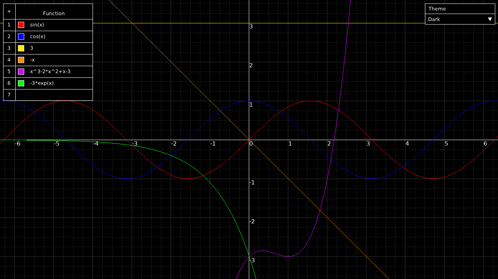
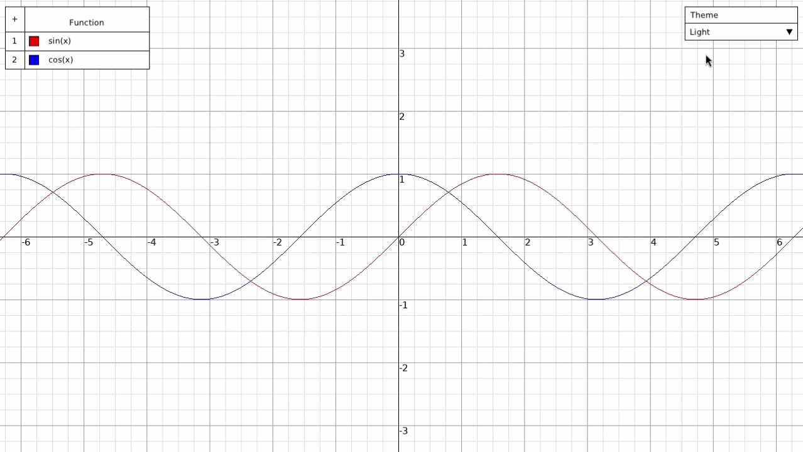
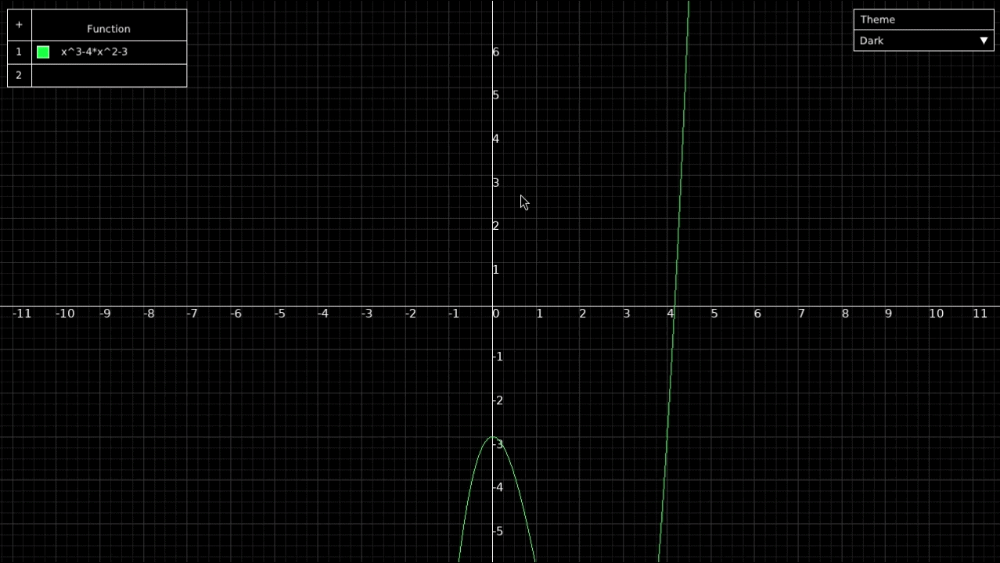
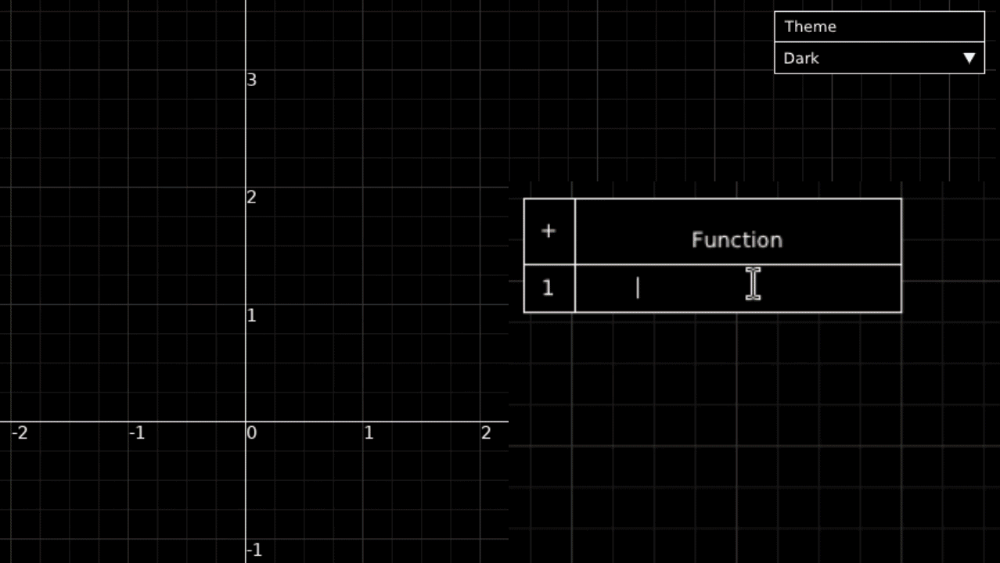

# MathPlotter++


Math Plotter++ is an application for plotting mathematical functions, built
with C++20, [SFML](https://github.com/SFML/SFML) for graphics, [muParser](https://github.com/beltoforion/muparser) for parsing mathematical expressions,
and [Dear ImGui](https://github.com/ocornut/imgui) for the user interface.

## Features

### Multiple Functions

Plot up to 15 mathematical functions simultaneously.



### Themes

Switch between three color themes.



### Navigation

Pan and zoom using the mouse while the coordinate grid dynamically adapts
to the current zoom level.



### Function Customization

Change function colors and get immediate feedback for invalid expressions.



## Architecture

Math Plotter++ is split into separate components, each responsible for a
specific part of the application.

- `Application`: manages the application lifecycle and coordinates components.
- `CameraController`: handles graph navigation, zooming, and the viewport.
- `GridRenderer`: renders the coordinate grid, axes, and labels.
- `FunctionRenderer`: parses and renders mathematical functions.
- `UserInterface`: manages the ImGui-based user interface.
- `Theme`: manages application color themes.
- `ColorPalette`: defines the colors used by the themes.

## Build and Run

Math Plotter++ currently targets Linux.

### Requirements

- C++20 compatible compiler
- CMake 3.22 or newer
- Git

On Ubuntu and other Debian-based distributions, install the required tools
and SFML system dependencies:

```bash
sudo apt update

sudo apt install \
    build-essential \
    cmake \
    git \
    libx11-dev \
    libxrandr-dev \
    libxcursor-dev \
    libxi-dev \
    libudev-dev \
    libfreetype-dev \
    libgl1-mesa-dev \
    libegl1-mesa-dev
```

### Build

Clone the repository:

```bash
git clone https://github.com/<username>/math-plotter.git
cd math-plotter
```

Configure and build the project:

```bash
cmake -S . -B build
cmake --build build
```

CMake automatically downloads and builds SFML, Dear ImGui, ImGui-SFML,
and muParser.

### Run

```bash
./build/mathplotter
```

## License

This project is licensed under the terms of the [MIT License](LICENSE).